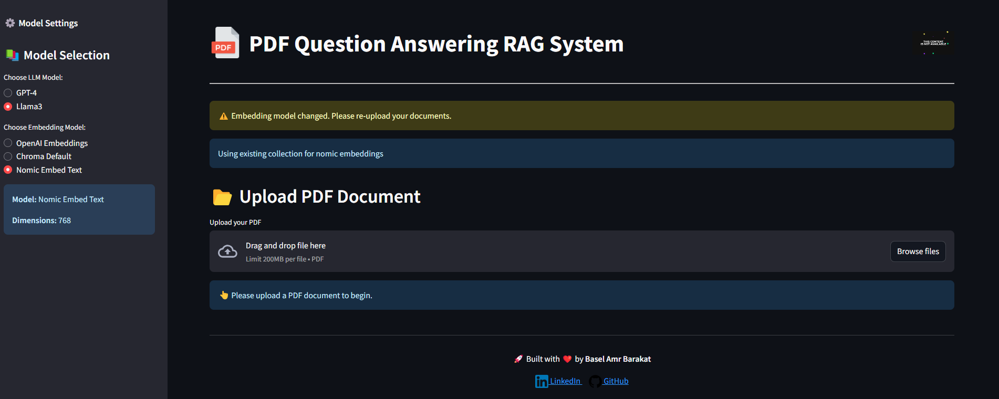
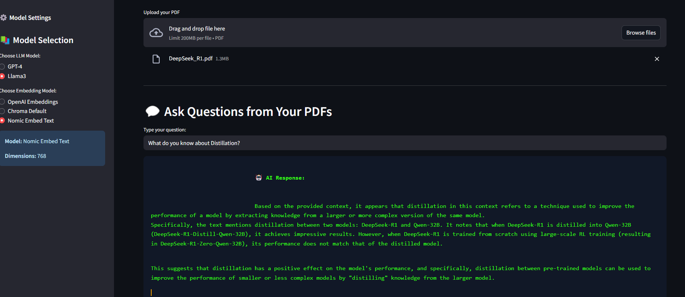

# 🧠 RAG PDF Assistant

A powerful and customizable Retrieval-Augmented Generation (RAG) assistant that lets you upload PDF documents, ask questions about their contents, and get AI-generated answers — all inside a sleek and interactive Streamlit app. Supports multiple LLMs and embedding models, including OpenAI and Ollama, and uses ChromaDB for efficient vector storage.


> 📽️ **[Watch Demo Video](Assets/demo_video.mp4)** *(click to view)*

---

## 🌟 Features

✅ Upload and process any PDF file  
✅ Split large documents into overlapping chunks  
✅ Choose from multiple **LLMs** (`GPT-4`, `Llama3`) and **embedding models**  
✅ Smart retrieval from `ChromaDB` vector store  
✅ Get contextual, explainable answers  
✅ Inline typewriter animation for AI responses  
✅ Source passage visibility and question history  
✅ Local or OpenAI-hosted deployment  
✅ Beautiful, responsive UI with zero horizontal scroll

---

## 🖼️ App Preview

| Home Interface | AI Response with RAG |
|----------------|----------------------|
|  |  |

---
## 🧰 Tech Stack

- [Streamlit](https://streamlit.io/)
- [OpenAI](https://openai.com/)
- [Ollama](https://ollama.ai/)
- [ChromaDB](https://docs.trychroma.com/)
- [PyPDF2](https://pypi.org/project/PyPDF2/)
- [dotenv](https://pypi.org/project/python-dotenv/)
- [uuid](https://docs.python.org/3/library/uuid.html)


---
## 🏗️ How It Works

1. **PDF Upload**  
   Drag and drop your PDF file into the app.

2. **Chunking**  
   The document is split into overlapping chunks using a configurable chunking logic.

3. **Embedding**  
   Chunks are embedded using the selected model (OpenAI, Nomic, or Chroma Default).

4. **Storage**  
   Vector representations are stored using ChromaDB's persistent client.

5. **Retrieval**  
   When you ask a question, top relevant chunks are retrieved.

6. **Generation**  
   The question + context is passed to an LLM (GPT-4 or Llama3) to generate a precise answer.
---
## 🚀 Getting Started

### 1️⃣ Clone the Repo

```bash
git clone https://github.com/Basel-Amr/rag-pdf-assistant.git
cd rag-pdf-assistant
```
### 2️⃣ Install Requirements
```bash
pip install -r requirements.txt
```

### 3️⃣ Run the App
```bash
streamlit run app.py
```

### ⚙️ Configuration
The sidebar inside the app allows you to:
-  Select between GPT-4 or LLaMA3 models
-  Choose an embedding model: OpenAI / Chroma / Nomic
